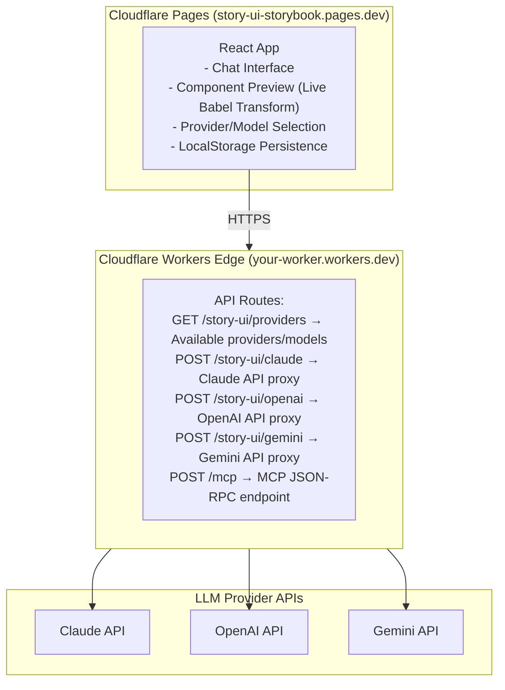

# Story UI - Claude Code Project Guide

> **Last Updated**: November 30, 2025
> **Current Version**: 3.0.0
> **Production URL**: Your Cloudflare Pages deployment URL
> **Backend URL**: Your Railway or Cloudflare Workers deployment URL

This document provides context for AI assistants working on the Story UI codebase. It captures project history, architecture decisions, resolved issues, and remaining work to prevent repeating past mistakes.

---

## Quick Reference

### Important Files

| Purpose | Location |
|---------|----------|
| Production App | `test-storybooks/mantine-storybook/.story-ui-build/src/App.tsx` |
| Cloudflare Worker | `cloudflare-edge/src/worker.ts` |
| MCP Server | `mcp-server/index.ts` |
| Story Generator | `story-generator/generateStory.ts` |
| Component Discovery | `story-generator/componentDiscovery.ts` |
| LLM Providers | `story-generator/llm-providers/` |
| Design Considerations | `test-storybooks/mantine-storybook/.story-ui-build/src/considerations.ts` |
| Production Requirements | `STORY_UI_PRODUCTION_REQUIREMENTS.md` |
| Detailed Roadmap | `ROADMAP.md` |

### Deployment Commands

```bash
# Deploy Cloudflare Worker
cd cloudflare-edge && wrangler deploy

# Build and Deploy Frontend
cd test-storybooks/mantine-storybook/.story-ui-build
npm run build
wrangler pages deploy dist --project-name=story-ui-storybook

# Build main package
npm run build
```

### Environment Variables (Cloudflare Worker)

| Variable | Description |
|----------|-------------|
| `ANTHROPIC_API_KEY` | Claude API key (required for Claude provider) |
| `OPENAI_API_KEY` | OpenAI API key (optional) |
| `GEMINI_API_KEY` | Gemini API key (optional) |
| `DEFAULT_MODEL` | Default Claude model |

---

## Project Overview

### What is Story UI?

Story UI is an AI-powered Storybook story generator that works with ANY component library. Users describe components in natural language, and the AI generates working Storybook stories using their design system's actual components.

### Two Environments

#### 1. Local Storybook Environment (The Gold Standard)

The original implementation runs as a Storybook addon panel:
- **Location**: `templates/StoryUI/StoryUIPanel.tsx`
- **How it works**: Embedded panel in Storybook's addon area
- **Features**: Full MCP integration, file-based story generation, component discovery
- **Status**: Mature and working

#### 2. Production Web Environment

A standalone web app that mimics local functionality:
- **Location**: `test-storybooks/mantine-storybook/.story-ui-build/`
- **Frontend**: React + Vite, deployed to Cloudflare Pages
- **Backend**: Cloudflare Workers edge proxy
- **Status**: Actively developed (November 2025)

---

## Architecture

### Production Environment Architecture



### Key Components

1. **Frontend (App.tsx)**
   - Chat interface with message history
   - Provider and model selection
   - Live component preview with Babel transformation
   - Image attachment support (vision)
   - LocalStorage persistence for chats and settings

2. **Cloudflare Worker (worker.ts)**
   - CORS-enabled API proxy
   - Multi-provider LLM support
   - Returns available providers based on configured API keys
   - Model selection per provider

3. **Considerations System**
   - Design-system-specific AI guidelines
   - Loaded from `considerations.ts` in production
   - Prevents wrong components/colors/patterns

---

## Feature Status

### Completed Features (Production)

| Feature | Status | Notes |
|---------|--------|-------|
| Multi-provider LLM (Claude, OpenAI, Gemini) | ✅ | Provider selector in sidebar |
| Model selection | ✅ | Latest 3 models per provider |
| Component generation | ✅ | Live Babel transform preview |
| Conversation history | ✅ | LocalStorage persistence |
| Smart chat titles | ✅ | LLM-generated from first message |
| Image attachments | ✅ | Vision support for screenshots |
| Design considerations | ✅ | Loaded from considerations.ts |
| Modern chat UI | ✅ | ChatGPT-style input interface |
| 225 Mantine components | ✅ | Auto-discovered registry |

### Pending Features

| Feature | Priority | Notes |
|---------|----------|-------|
| Multi-framework (Vue, Angular, etc.) | HIGH | Backend supports, frontend needs work |
| Delete chat functionality | MEDIUM | UI exists, needs implementation |
| SSE streaming | MEDIUM | Backend ready, frontend needs integration |
| Two-way conversational AI | LOW | Intent preview, progress updates |
| PDF upload | LOW | For design specs |

---

## Issue History & Resolutions

### Resolved Issues (November 2025)

| Issue | Root Cause | Resolution |
|-------|------------|------------|
| "Failed to fetch" error | Missing `/story-ui/claude` endpoint in worker | Added endpoint to `cloudflare-edge/src/worker.ts` |
| White text on light background | LLM generating incorrect colors | Added universal best practices to system prompt + design considerations |
| LLM returning markdown | Missing assistant prefill | Added `<` prefill to force JSX output |
| Iteration showing `<budget>` tags | LLM returning metadata | Improved system prompt instructions |
| Mantine hardcoded in App.tsx | Design-system-specific code | Moved to considerations.ts |
| Provider dropdown showing one option | No conditional rendering | Show text if single provider, dropdown if multiple |
| Stale closure in useLocalStorage | React state closure issue | Fixed hook to use functional updates |
| Chat titles not updating | Missing LLM call for title generation | Added `generateChatTitle` function |
| Model not passed to API | Missing parameter in request | Added `model` to request body |

### Common Pitfalls to Avoid

1. **Don't hardcode design systems** - Use `considerations.ts` for design-system-specific rules
2. **Don't forget CORS** - All worker endpoints need CORS headers
3. **Don't use deprecated models** - Update model lists when providers release new versions
4. **Don't skip prefill** - Always prefill with `<` to ensure JSX output
5. **Don't ignore localStorage** - It's the primary persistence mechanism in production
6. **Deploy from correct directory** - Frontend deploy must be from `.story-ui-build`, not `cloudflare-edge`

---

## Codebase Structure

```
story-ui-repo/
├── cli/                          # CLI commands (init, start, deploy)
│   ├── index.ts                  # Main CLI entry
│   └── deploy.ts                 # Deployment commands
├── cloudflare-edge/              # Production backend
│   └── src/
│       ├── worker.ts             # Main Cloudflare Worker
│       ├── mcp-session.ts        # MCP session handling
│       └── types.ts              # TypeScript types
├── mcp-server/                   # Local MCP server
│   ├── index.ts                  # Express server with routes
│   ├── mcp-stdio-server.ts       # STDIO MCP server
│   └── routes/                   # API route handlers
├── story-generator/              # Core story generation logic
│   ├── generateStory.ts          # Main generation function
│   ├── componentDiscovery.ts     # Component discovery
│   ├── llm-providers/            # LLM provider implementations
│   │   ├── base-provider.ts      # Base class
│   │   ├── claude-provider.ts    # Claude/Anthropic
│   │   ├── openai-provider.ts    # OpenAI/GPT
│   │   └── gemini-provider.ts    # Google Gemini
│   └── framework-adapters/       # React, Vue, Angular, etc.
├── templates/                    # Storybook integration templates
│   └── StoryUI/
│       ├── StoryUIPanel.tsx      # Main panel component
│       └── index.tsx             # Panel registration
├── test-storybooks/              # Test environments (gitignored)
│   └── mantine-storybook/
│       └── .story-ui-build/      # Production frontend app
│           ├── src/
│           │   ├── App.tsx       # Main production app
│           │   └── considerations.ts  # Design system rules
│           └── dist/             # Built static files
├── docs/                         # Documentation
├── ROADMAP.md                    # Detailed task tracking
├── STORY_UI_PRODUCTION_REQUIREMENTS.md  # Production requirements
└── DEPLOYMENT.md                 # Deployment guide
```

---

## Development Workflow

### Making Changes to Production

1. **Edit the source** in `test-storybooks/mantine-storybook/.story-ui-build/src/`
2. **Test locally**: `npm run dev` (from .story-ui-build directory)
3. **Build**: `npm run build`
4. **Deploy frontend**: `wrangler pages deploy dist --project-name=story-ui-storybook`

### Making Changes to Worker

1. **Edit** `cloudflare-edge/src/worker.ts`
2. **Deploy**: `cd cloudflare-edge && wrangler deploy`
3. **Verify**: Check the deployed endpoint

### Railway Deployment

Railway is the primary deployment platform for the full-stack Story UI application:

1. **Deployment Platform**: Railway provides containerized deployment with automatic builds
2. **Reverse Proxy**: Caddy is configured to handle HTTPS and routing
3. **Environment**: All LLM provider API keys are configured as Railway environment variables
4. **Auto-deploy**: Connected to git repository for automatic deployments on push

To deploy to Railway:
```bash
# Railway CLI deployment
railway up

# Or push to main branch for auto-deployment
git push origin main
```

### Testing

Use Chrome DevTools MCP for automated browser testing:
```
- Navigate to production URL
- Take snapshots/screenshots
- Click elements
- Verify UI changes
```

---

## Provider Configuration

### Claude Models (Anthropic)

```typescript
models: [
  'claude-opus-4-5-20251101',      // Claude Opus 4.5 - Most capable
  'claude-sonnet-4-5-20250929',    // Claude Sonnet 4.5 - Recommended default
  'claude-haiku-4-5-20251001'      // Claude Haiku 4.5 - Fast, economical
]
```

### OpenAI Models

```typescript
models: [
  'gpt-5.1',                       // GPT-5.1 - Latest with adaptive reasoning
  'gpt-5.1-thinking',              // GPT-5.1 Thinking - Extended reasoning
  'gpt-4o',                        // GPT-4o - Fast multimodal, recommended default
  'gpt-4o-mini'                    // GPT-4o Mini - Economical
]
```

### Gemini Models

```typescript
models: [
  'gemini-3-pro',                  // Gemini 3 Pro - Most intelligent
  'gemini-2.0-flash-exp',          // Gemini 2.0 Flash Experimental
  'gemini-2.0-flash',              // Gemini 2.0 Flash - Recommended default
  'gemini-1.5-pro'                 // Gemini 1.5 Pro - Large context
]
```

---

## System Prompt Structure

The production app sends prompts with this structure:

```
1. Universal best practices (theming, accessibility, responsive design)
2. Design-system-specific considerations (from considerations.ts)
3. Available components list (225 Mantine components)
4. User's request
5. Conversation history (for iterations)
6. Previous code (for modifications)
```

**Important**: Always prefill the assistant response with `<` to ensure the LLM outputs JSX directly without markdown.

---

## LocalStorage Keys

| Key | Purpose |
|-----|---------|
| `storyui_chats` | All chat conversations |
| `storyui_activeChat` | Currently active chat ID |
| `storyui_provider` | Selected LLM provider |
| `storyui_model` | Selected model |
| `storyui_sidebar_collapsed` | Sidebar state |

---

## Debugging Checklist

When issues occur, check in order:

1. **Console errors** - Browser DevTools Console tab
2. **Network requests** - Browser DevTools Network tab (look for failed requests)
3. **Worker logs** - `wrangler tail` in cloudflare-edge directory
4. **API response** - Check if LLM is returning expected format
5. **CORS headers** - Ensure OPTIONS requests return correct headers
6. **API keys** - Verify secrets are set in Cloudflare dashboard

---

## Roadmap

### Immediate (This Sprint)

- [ ] Implement delete chat functionality
- [ ] Add conversation export feature
- [ ] Improve error handling and user feedback

### Short Term

- [ ] SSE streaming for real-time generation feedback
- [ ] Multi-framework support in production (Vue, Angular)
- [ ] User authentication for personalized experience

### Long Term

- [ ] Visual Builder revival (proper implementation)
- [ ] Figma plugin integration
- [ ] Team collaboration features
- [ ] Design token extraction

---

## Visual Builder Status

**DEFERRED** - The Visual Builder is fundamentally broken for Story UI's value proposition:

- Only works with hardcoded Mantine components
- Cannot render user's custom design system components
- Hidden from UI (button removed)
- Code preserved in `dist/visual-builder/` for future reference

See `ROADMAP.md` section "DEFERRED: Visual Builder" for full analysis.

---

## Contact & Resources

- **Repository**: Your repository URL
- **NPM Package**: Your npm package URL
- **Issues**: Your issues URL

---

*This document should be updated whenever significant changes are made to the codebase, architecture, or deployment process.*
