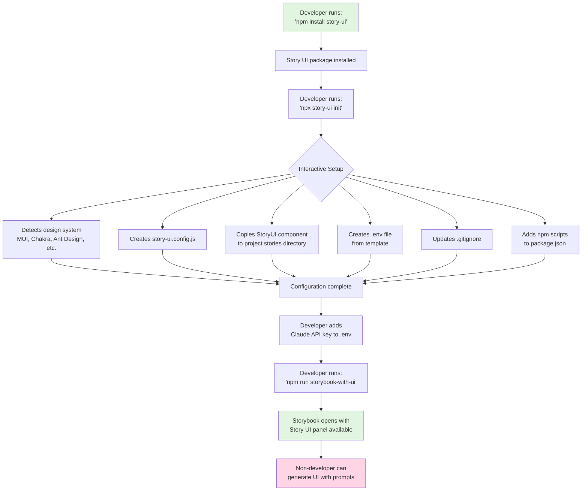
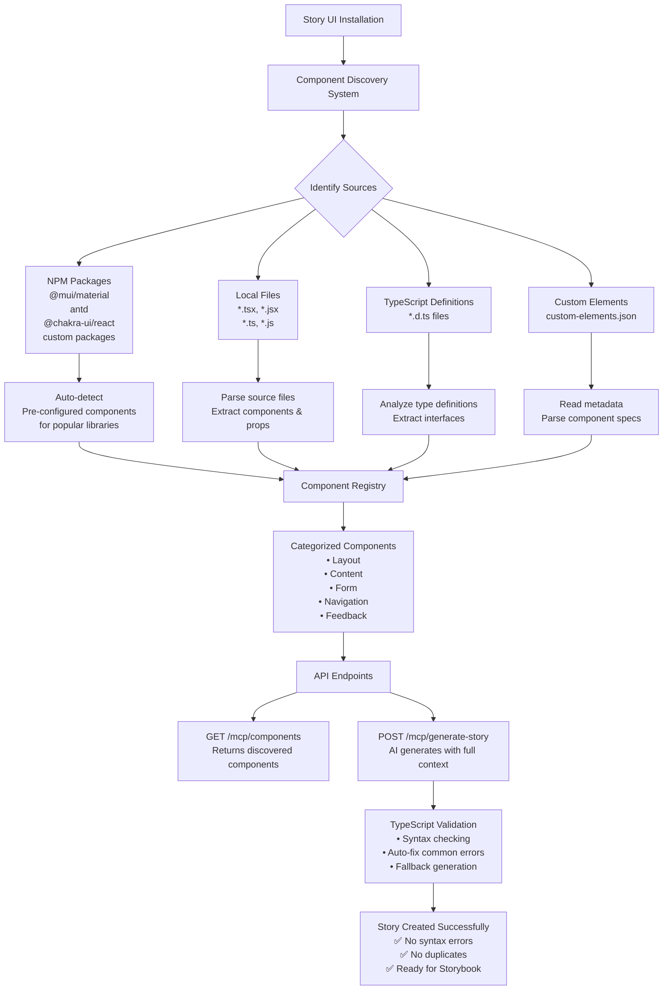

# Story UI - AI-Powered Storybook Story Generator

[](https://www.npmjs.com/package/@tpitre/story-ui)
[](https://opensource.org/licenses/MIT)

Story UI is a flexible, AI-powered tool that generates Storybook stories for any React component library. It uses Claude AI to understand natural language prompts and create accurate, multi-column layouts using your existing components.

## Features

- 🤖 **AI-Powered Generation**: Uses Claude AI to generate stories from natural language prompts
- 🔧 **Component Library Agnostic**: Works with any React component library
- 📱 **Smart Layout Generation**: Automatically creates proper multi-column layouts
- 🔍 **Component Discovery**: Automatically discovers and analyzes your components
- ⚙️ **Flexible Configuration**: Highly customizable for different design systems
- 🚀 **MCP Server**: Integrates with Claude Desktop and other MCP clients
- 🗂️ **Git Integration**: Automatically manages .gitignore for ephemeral stories
- 🧹 **Cleanup Utilities**: Built-in cleanup for old generated stories
- 🎨 **Built-in UI**: Includes a Storybook panel for easy interaction

## Roadmap

Check out our [development roadmap](./ROADMAP.md) to see what's coming next and how you can contribute to the future of Story UI. We're planning exciting features like multi-framework support, story sharing, and advanced collaboration tools.

## Quick Start

### 1. Installation

```bash
npm install @tpitre/story-ui --save-dev
# or
yarn add -D @tpitre/story-ui
```

### 2. Run Setup

```bash
npx story-ui init
```

This interactive setup will:
- ✅ Detect your design system (Material-UI, Chakra UI, Ant Design, etc.)
- ✅ Create configuration file (`story-ui.config.js`)
- ✅ Install the Story UI panel component in your stories
- ✅ Create `.env` file for API configuration
- ✅ Add convenience scripts to your `package.json`
- ✅ Update `.gitignore` with appropriate patterns

### 3. Add Your Claude API Key

If you didn't add it during setup, edit the `.env` file:

```bash
# Get your API key from: https://console.anthropic.com/
CLAUDE_API_KEY=your-claude-api-key-here
```

**Important:** Keep your API key secure and never commit `.env` files to version control!

### 4. Start Using Story UI

Run both Storybook and Story UI together:

```bash
npm run storybook-with-ui
```

Or run them separately:

```bash
# Terminal 1
npm run storybook

# Terminal 2
npm run story-ui
```

### 5. Generate Your First Story

1. Open Storybook in your browser
2. Navigate to **"Story UI > Story Generator"** in the sidebar
3. Enter a natural language prompt like:
   - "Create a login form with email and password fields"
   - "Build a three-column dashboard with cards"
   - "Design a hero section with navigation"
4. Click "Generate" and watch your UI come to life!

## How It Works

1. **Component Discovery**: Story UI automatically discovers all components in your project
2. **AI Understanding**: Your prompt is processed by Claude AI with knowledge of your components
3. **Code Generation**: Clean, production-ready story code is generated
4. **Live Preview**: See your generated UI instantly in Storybook
5. **Iteration**: Refine your designs with follow-up prompts in the same session

## What Gets Installed

After running `npx story-ui init`, your project structure will include:

```
your-project/
├── .env                          # Created from template
├── story-ui.config.js           # Generated configuration
├── src/stories/
│   ├── StoryUI/                 # UI component
│   │   ├── StoryUIPanel.tsx
│   │   ├── StoryUIPanel.stories.tsx
│   │   └── index.tsx
│   └── generated/               # Where AI stories go
└── package.json                 # Updated with scripts
```

## Installation Flow



## Configuration Options

### Complete Configuration Interface

```typescript
interface StoryUIConfig {
  // File paths
  generatedStoriesPath: string;        // Where to save generated stories
  componentsPath?: string;             // Path to your components
  componentsMetadataPath?: string;     // Path to custom-elements.json (optional)

  // Story configuration
  storyPrefix: string;                 // Prefix for story titles
  defaultAuthor: string;               // Default author name
  importPath: string;                  // Import path for components

  // Component system configuration
  componentPrefix: string;             // Component naming prefix
  components: ComponentConfig[];       // Component definitions
  layoutRules: LayoutRules;           // Layout generation rules

  // Template configuration
  sampleStory?: string;               // Custom story template
  systemPrompt?: string;              // Custom AI system prompt
}
```

### Layout Rules Configuration

```typescript
interface LayoutRules {
  multiColumnWrapper?: string;        // Main layout component
  columnComponent?: string;           // Column/section component
  containerComponent?: string;        // Container wrapper component
  layoutExamples?: {
    twoColumn?: string;               // Two-column layout example
    threeColumn?: string;             // Three-column layout example
    grid?: string;                    // Grid layout example
  };
  prohibitedElements?: string[];      // HTML elements to avoid
}
```

## Configuration Methods

### 1. Configuration File

Create `story-ui.config.js`:

```javascript
export default {
  generatedStoriesPath: './src/stories/generated',
  componentsPath: './src/components',
  importPath: 'my-design-system',
  componentPrefix: 'DS',
  layoutRules: {
    multiColumnWrapper: 'DSLayout',
    columnComponent: 'DSColumn'
  }
};
```

### 2. Package.json Configuration

Add to your `package.json`:

```json
{
  "storyUI": {
    "generatedStoriesPath": "./src/stories/generated",
    "componentsPath": "./src/components",
    "importPath": "my-design-system",
    "componentPrefix": "DS"
  }
}
```

### 3. Auto-Detection

Story UI can automatically detect your project structure:

```bash
npx story-ui init --auto-detect
```

## Component Discovery

Story UI features an **Enhanced Component Discovery System** that automatically finds and categorizes your design system components:

### How It Works



### Discovery Methods

1. **Pre-configured Libraries**: Built-in component lists for popular design systems (Ant Design, MUI, Chakra UI)
2. **Directory Structure**: Scans component directories for `.tsx` files
3. **Story Files**: Extracts component information from existing `.stories.tsx` files
4. **Custom Elements**: Reads `custom-elements.json` for web components
5. **Package Exports**: Analyzes package.json exports and index files
6. **TypeScript Definitions**: Parses `.d.ts` files for component interfaces

### Features

- ✅ **Zero Configuration**: Works out of the box with popular design systems
- ✅ **Intelligent Categorization**: Automatically groups components by type
- ✅ **Props Discovery**: Extracts component properties and types
- ✅ **Validation System**: Catches and fixes common TypeScript errors
- ✅ **Duplicate Prevention**: Tracks generated stories to avoid duplicates
- ✅ **Performance Optimized**: Caches discovered components with 1-minute TTL

## Design System Examples

### Material-UI

```javascript
export default {
  importPath: '@mui/material',
  componentPrefix: '',
  layoutRules: {
    multiColumnWrapper: 'Grid',
    columnComponent: 'Grid',
    layoutExamples: {
      twoColumn: `<Grid container spacing={2}>
  <Grid item xs={6}>
    <Card>Left content</Card>
  </Grid>
  <Grid item xs={6}>
    <Card>Right content</Card>
  </Grid>
</Grid>`
    }
  }
};
```

### Chakra UI

```javascript
export default {
  importPath: '@chakra-ui/react',
  componentPrefix: '',
  layoutRules: {
    multiColumnWrapper: 'SimpleGrid',
    columnComponent: 'Box',
    layoutExamples: {
      twoColumn: `<SimpleGrid columns={2} spacing={4}>
  <Box>
    <Card>Left content</Card>
  </Box>
  <Box>
    <Card>Right content</Card>
  </Box>
</SimpleGrid>`
    }
  }
};
```

### Ant Design

```javascript
export default {
  importPath: 'antd',
  componentPrefix: '',
  layoutRules: {
    multiColumnWrapper: 'Row',
    columnComponent: 'Col',
    layoutExamples: {
      twoColumn: `<Row gutter={16}>
  <Col span={12}>
    <Card>Left content</Card>
  </Col>
  <Col span={12}>
    <Card>Right content</Card>
  </Col>
</Row>`
    }
  }
};
```

## API Reference

### HTTP Endpoints

#### POST `/mcp/generate-story`

Generate a new story from a natural language prompt.

**Request Body:**
```json
{
  "prompt": "Create a three-column layout with different card types",
  "fileName": "optional-custom-filename.stories.tsx"
}
```

**Response:**
```json
{
  "success": true,
  "fileName": "generated-filename.stories.tsx",
  "outPath": "/path/to/generated/story",
  "title": "Generated Story Title",
  "story": "// Generated story content..."
}
```

#### GET `/mcp/components`

Get all discovered components from your design system.

**Response:**
```json
[
  {
    "name": "Button",
    "description": "Button component",
    "category": "form",
    "props": ["type", "size", "loading", "icon", "onClick"],
    "slots": []
  },
  // ... more components
]
```

#### GET `/mcp/stories`

Get all generated stories (production mode only).

**Response:**
```json
[
  {
    "id": "story-abc123",
    "title": "Login Form",
    "createdAt": "2024-01-15T10:30:00Z",
    "components": ["Form", "Input", "Button"]
  },
  // ... more stories
]
```

#### GET `/mcp/stories/:id/content`

Get the content of a specific story (production mode only).

**Response:**
```json
{
  "id": "story-abc123",
  "title": "Login Form",
  "content": "// Full story TypeScript code...",
  "createdAt": "2024-01-15T10:30:00Z"
}
```

#### GET `/mcp/stats`

Get server and memory statistics (production mode only).

**Response:**
```json
{
  "environment": "production",
  "uptime": 3600,
  "storyCount": 12,
  "totalSizeMB": 0.5,
  "memoryLimit": 50,
  "oldestStory": "2024-01-15T08:00:00Z"
}
```

### MCP Integration

Story UI includes an MCP (Model Context Protocol) server for integration with Claude Desktop:

1. Add to your Claude Desktop configuration:
```json
{
  "mcpServers": {
    "story-ui": {
      "command": "node",
      "args": ["/path/to/story-ui/dist/mcp-server/index.js"]
    }
  }
}
```

2. Use in Claude Desktop:
```
Generate a two-column layout with cards using Story UI
```

## CLI Commands

### Initialize Configuration

```bash
npx story-ui init
npx story-ui init --auto-detect
npx story-ui init --template=material-ui
```

### Start Server

```bash
npx story-ui start
npx story-ui start --port=4001
npx story-ui start --config=./custom-config.js
```

### Generate Sample Config

```bash
npx story-ui config --generate
npx story-ui config --generate --type=json
```

## Environment Variables

```bash
CLAUDE_API_KEY=your_claude_api_key_here
CLAUDE_MODEL=claude-sonnet-4-20250514  # Optional, defaults to latest Sonnet
PORT=4001                              # Optional, defaults to 4001
```

## Production-Ready Deployment

Story UI is designed for **seamless deployment** across development and production environments, with automatic environment detection and appropriate story generation strategies.

### 🌐 **Environment Detection**

Story UI automatically detects your environment:

**Development Environment:**
- ✅ **File-system storage** - Stories written to configured directory
- ✅ **Automatic .gitignore** - Generated directory added to git ignore
- ✅ **Directory structure** - Creates necessary folders and README

**Production Environment (Vercel, Netlify, etc.):**
- ✅ **In-memory storage** - Stories stored in server memory
- ✅ **Read-only compatibility** - Works without file system write permissions
- ✅ **Memory management** - Automatic cleanup to prevent memory leaks
- ✅ **API endpoints** - RESTful API for story management

### 🔧 **Automatic Setup**

```bash
# Development setup
npx story-ui init --auto-detect

# Production deployment
# No additional setup needed - automatically detected!
```

### 🗂️ **Git Integration**

**Development:**
```bash
# Automatically adds to .gitignore:
./libs/your-components/src/components/generated/
./libs/your-components/src/components/generated/**
```

**Production:**
- Stories stored in memory only
- No file system writes required
- Perfect for read-only deployments

### 🎯 **Use Cases**

**Perfect for:**
- 🎨 **Layout Testing** - Test component arrangements without committing
- 👥 **Stakeholder Review** - Share layouts with product owners and designers
- 🔄 **Rapid Iteration** - Generate, test, and regenerate layouts quickly
- 📱 **Design Validation** - Validate designs before implementation
- 🌐 **Public Demos** - Deploy to Vercel/Netlify for team collaboration

**Example Production Workflow:**
1. Deploy Storybook + Story UI to Vercel/Netlify
2. Product owners generate layouts using natural language
3. Stories stored in server memory (ephemeral)
4. Share generated stories with team for feedback
5. Iterate and refine layouts
6. Implement approved layouts in actual codebase

### 🧹 **Cleanup Scripts**

Story UI includes built-in cleanup scripts for testing and demo purposes. Perfect for cleaning up between test runs or preparing for video demos.

**Automated Cleanup (Recommended):**
```bash
# Cross-platform Node.js script
npm run cleanup

# Or use the bash script (Linux/macOS)
./scripts/cleanup-story-ui.sh
```

**What gets cleaned up:**
- Configuration files (`story-ui.config.js`, `.env` only if created by Story UI)
- Generated stories directories (`src/stories/generated/`, etc.)
- StoryUI components (`src/stories/StoryUI/`)
- Cache files and story tracking files
- Git ignore patterns

**Safety features:**
- ✅ **Environment Protection** - Preserves existing `.env` files (only removes ones created by Story UI)
- ✅ **Safe Removal** - Only removes files that actually exist
- ✅ **Non-destructive** - Won't break your existing project

**Manual cleanup:**
```bash
npm uninstall @tpitre/story-ui
rm -rf src/stories/generated/
rm story-ui.config.js
```

See [scripts/README.md](./scripts/README.md) for detailed documentation.

### 📊 **Production Monitoring**

```bash
# Check server status and memory usage
curl http://your-server.vercel.app/mcp/stats

# Get all generated stories
curl http://your-server.vercel.app/mcp/stories

# Get specific story content
curl http://your-server.vercel.app/mcp/stories/story-abc123/content
```

### 🧹 **Memory Management**

Production environments automatically:
- 🔄 **Cleanup old stories** - Removes stories older than 24 hours
- 📊 **Memory limits** - Keeps maximum 50 stories in memory
- 📈 **Usage tracking** - Monitors memory usage and story access patterns

```javascript
import { ProductionGitignoreManager, getInMemoryStoryService } from 'story-ui';

// Manual cleanup if needed
const manager = new ProductionGitignoreManager(config);
manager.cleanupOldStories();

// Memory statistics
const storyService = getInMemoryStoryService(config);
const stats = storyService.getMemoryStats();
console.log(`${stats.storyCount} stories using ${stats.totalSizeMB}MB`);
```

## Contributing

Story UI is designed to be community-driven and extensible. Contributions are welcome!

### Development Setup

```bash
git clone https://github.com/southleft/story-ui
cd story-ui
npm install
npm run build
npm run start
```

### Adding Design System Templates

1. Create a new configuration template in `templates/`
2. Add examples and documentation
3. Submit a pull request

## License

MIT License - see LICENSE file for details.

## Publishing to npm

Story UI uses [Semantic Release](https://semantic-release.gitbook.io/semantic-release/) for automated versioning and publishing.

### Automated Releases

When you push to the `main` branch, GitHub Actions automatically:
1. Analyzes commit messages to determine version bump
2. Updates version in package.json
3. Generates/updates CHANGELOG.md
4. Creates a GitHub release
5. Publishes to npm

### Commit Convention

Follow the [Conventional Commits](https://www.conventionalcommits.org/) format:

```bash
# Features (minor version bump)
git commit -m "feat: add dark mode support"

# Bug fixes (patch version bump)
git commit -m "fix: resolve TypeScript error in CLI"

# Breaking changes (major version bump)
git commit -m "feat!: redesign configuration API"
```

See [COMMIT_CONVENTION.md](./COMMIT_CONVENTION.md) for detailed guidelines.

### Manual Release (if needed)

```bash
# Dry run to see what would be released
npm run release:dry-run

# Manual release (not recommended - use automated releases)
npm run release
```

### Setup Requirements

For automated releases to work, you need to add an NPM_TOKEN secret to your GitHub repository:
1. Generate an npm token: `npm token create`
2. Add it to GitHub: Settings → Secrets → Actions → New repository secret
3. Name: `NPM_TOKEN`, Value: your npm token

## Troubleshooting

### "The requested module does not provide an export named 'Meta'"

This error occurs when Story UI is installed in a Vite-based Storybook project. The issue happens because the template uses `@storybook/react` imports, but Vite projects require `@storybook/react-vite`.

**Solution:**
1. Update your `src/stories/StoryUI/StoryUIPanel.stories.tsx` file
2. Change the import from:
   ```typescript
   import { StoryFn, Meta } from '@storybook/react';
   ```
   To:
   ```typescript
   import type { StoryFn, Meta } from '@storybook/react-vite';
   ```

**Note:** This issue has been fixed in Story UI v1.2.0+. The init command now automatically detects your Storybook framework and uses the correct import.

### Configuration validation errors

If you see "Components path does not exist" error when using a design system from npm (like Ant Design):

**Solution:**
Add `componentsPath: null` to your `story-ui.config.js`:
```javascript
module.exports = {
  importPath: "antd",
  componentPrefix: "",
  componentsPath: null,
  // ... rest of config
};
```

## Support

- 📖 [Documentation](https://github.com/southleft/story-ui#readme)
- 🐛 [Issues](https://github.com/southleft/story-ui/issues)
