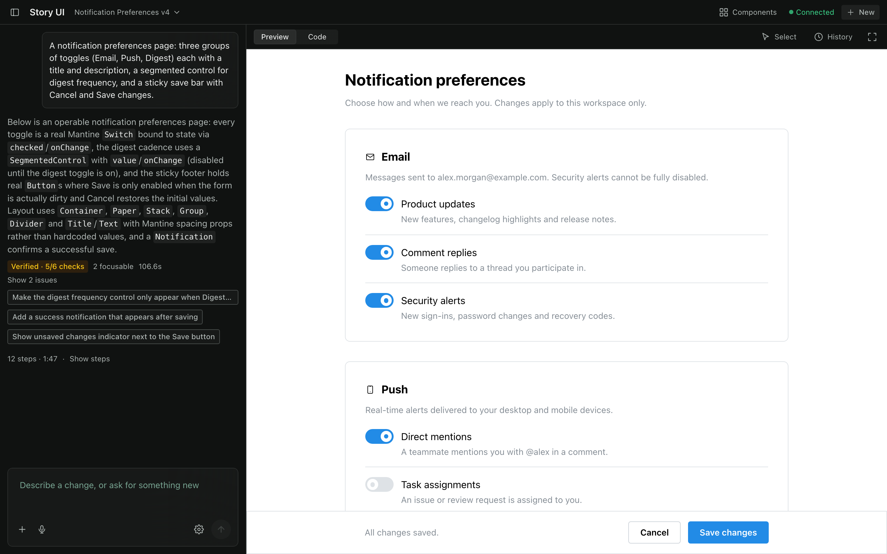
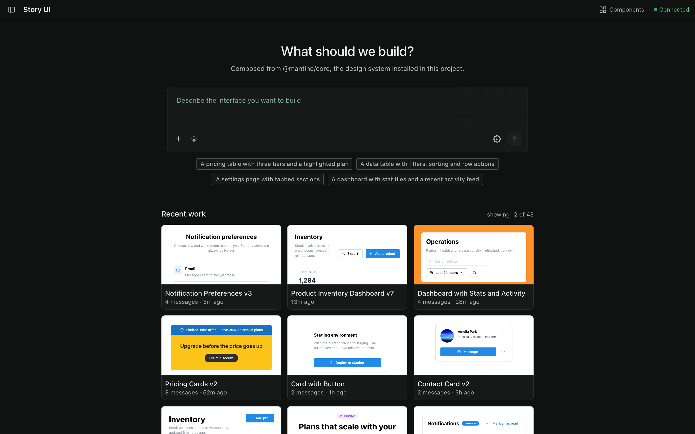
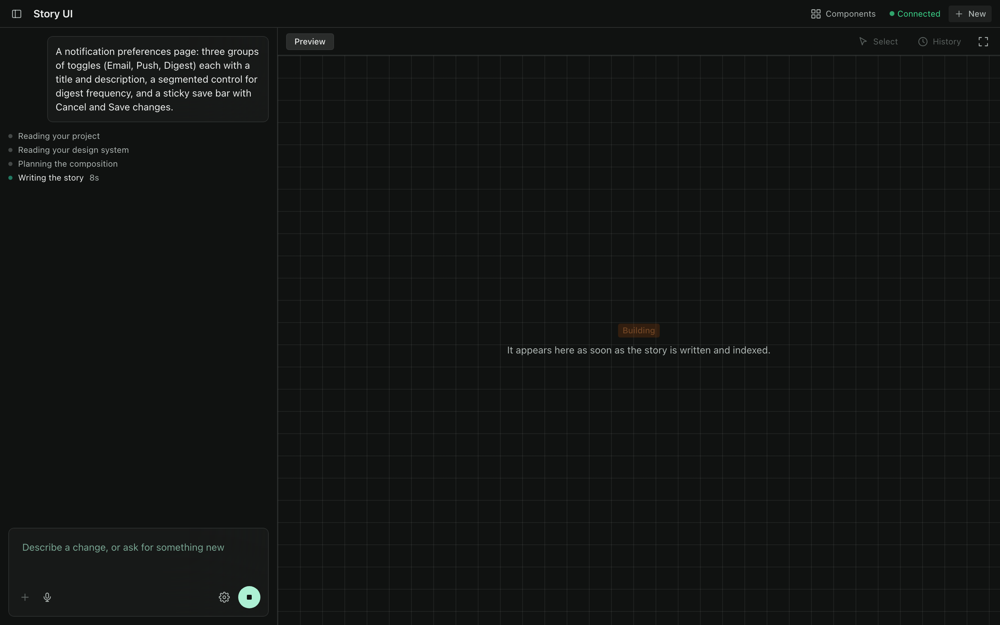
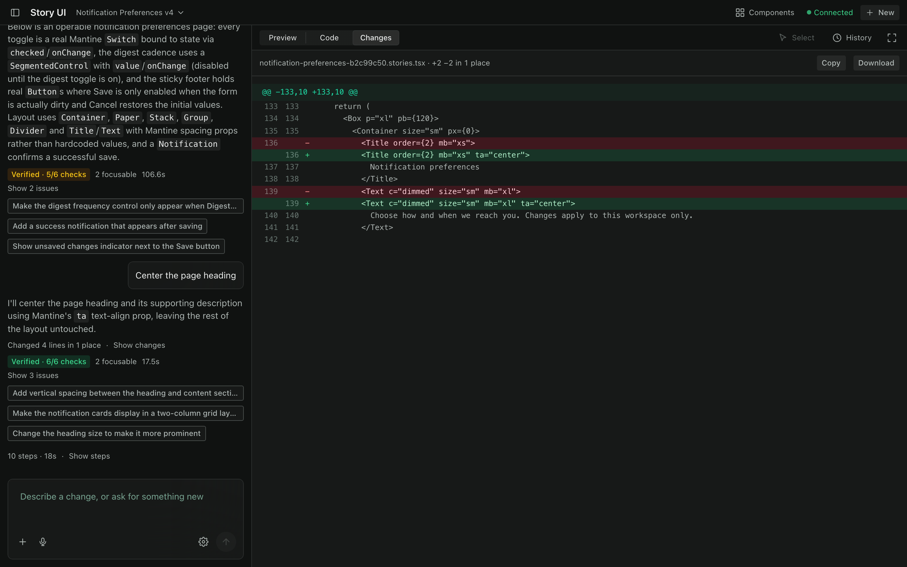
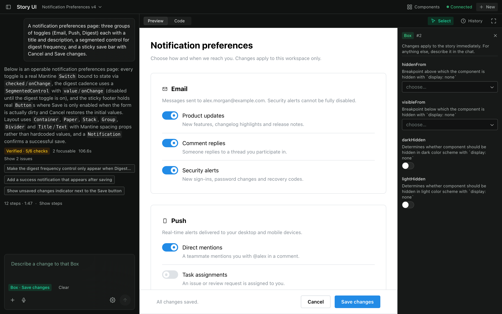

# Story UI

[](https://www.npmjs.com/package/@tpitre/story-ui)
[](LICENSE)

Story UI is a workspace inside your Storybook for composing screens from the
design system that is actually installed in the project. Describe what you
want; the server discovers your components (from the package's type
declarations, from local source, and from Storybook's own index), asks a model
to write a `.stories.tsx` file with them, writes the file, and shows it in
Storybook's own preview iframe. The preview is not a sandbox: it is your
Storybook, your providers, your theme, your tokens.



Once a story exists you change it in two different ways. Compositional
changes ("add a filters panel", "center the pagination") go back through the
model as an edit of the existing file, and you see exactly which lines moved.
Parametric changes ("make this button the secondary variant") do not touch a
model at all: click the element, the inspector reads the prop's legal values
from the component's own types, and one attribute of one element is rewritten
as an AST edit. Every generated story is then rendered in a real browser and
checked, and the badge names which checks ran and which could not.

Story UI is built and tested for **React + TypeScript** design systems, both
npm packages and local source. Other frameworks get the classic panel; see
[Framework support](#framework-support).

## Requirements

- Node 20 or newer.
- Storybook 9 or newer. Development runs against 10; 9 is verified with the same flow matrix. Storybook 8 is not supported.
- A React + TypeScript design system for the full workspace.
- An API key for Anthropic, OpenAI or Google Gemini.
- For verification: `playwright` installed in your project with a browser downloaded (`npx playwright install chromium`). `axe-core` is optional and enables the accessibility check.

## Quick start

```bash
npx @tpitre/story-ui@latest init   # asks a few questions, installs itself, writes config and the workspace entry
npx story-ui check                 # says what works and what to fix, with the command for each
npm run storybook-with-ui          # your Storybook and the Story UI server together
```

No prior install is needed: `init` adds `@tpitre/story-ui` to your devDependencies
and installs it. If you prefer two steps, `npm install -D @tpitre/story-ui` then
`npx story-ui init` does the same.

Open Storybook and click **Story UI** in the toolbar, or go to
`?path=/workspace/`. Type a request and press Enter. The story appears in the
preview the moment the file is written, and under `Generated/` in Storybook's
sidebar.

`init` creates `story-ui.config.js`, `.env` (provider, key, port),
`.storybook/manager-head.html` (a `<meta name="story-ui-port">` so the
workspace page knows the port — the manager cannot read `.env`),
`story-ui-considerations.md`, a `story-ui-docs/` directory, the generated
stories directory, `src/stories/StoryUIV2/StoryUIV2.mdx` (the workspace as a
docs page), `src/stories/StoryUI/` (the classic panel, its Voice Canvas and
the manager addon), and wires `.storybook/manager.ts`. It adds `story-ui` and
`storybook-with-ui` scripts to `package.json`, with `concurrently` as a
devDependency for the second, and `react-live` as a devDependency on React
projects for the Voice Canvas (remove both with `src/stories/StoryUI/voice/` if
you do not use it). The port you choose is written to all three places that
need it: `.env`, `manager-head.html` and the `story-ui` script's `--port`.
Paths in `story-ui.config.js` are project-relative (`./src/stories/generated/`,
`./src/components`), so the file survives a clone. An existing `.env` is
merged, not skipped: the provider's key line and `VITE_STORY_UI_PORT` are
replaced or appended, every other line is left alone. It keeps an existing
config unless you pass `--force`, and only removes Storybook's own scaffold
(`Button`/`Header`/`Page`, `Configure.mdx` and the images it imports) after
checking the file content is the scaffold — and it never mistakes that
scaffold for your component library: `src/stories` holding only scaffold
stories is not a component directory, `src/components` is. After editing
`.storybook/main.*` it parses the file and exits non-zero if the result would
not load.

A component library that is its own package (the stories import
`@your-scope/ui`, the source is `src/components`) is configured as local
source: `importPath` becomes a path relative to the generated stories
directory and `componentsPath` the directory. The project's own package name
is never written as the import path — nothing can install it. The relative
path is chosen so that it resolves from the generated directory: `../../components`
when `src/components` has an `index.ts`; the nearest ancestor barrel that
re-exports the components (`../..` for a `src/index.ts` over an index-less
`src/components`) when it does not; and `importStyle: 'individual'` with
per-component paths when there is no barrel at all. `check` fails the
`import-path` item, with the fix, whenever a relative `importPath` would not
resolve — that was every generated story failing with "Failed to resolve
import".

The long-form walkthrough is in [docs/quick-start.md](docs/quick-start.md).

## What you get

**A prompt, with references.** The composer takes text, up to five images, and
files: a Markdown spec, a CSV of the rows a table should show, JSON, code, or a
PDF brief. Text files are inlined for the model as reference material; PDFs are
read natively by Claude. The microphone dictates where the browser supports the
Web Speech API. Provider, model and keyboard shortcuts live behind the gear.



**Narration while it works.** The model's plan streams into the conversation
as it thinks, then the code streams as it is written, with a step list that
folds to one line when the run finishes. Stop is the same button as Send.



**A preview at write time.** The right pane is Storybook's `/iframe.html`
showing the story the moment the file lands, before verification starts. The
canvas has three views: Preview, Code (read-only source with copy), and
Changes, which appears after an edit and shows the diff against the previous
version. The fullscreen button takes the canvas over the whole page; the
sidebar toggle in the header hides Storybook's own chrome.

**Iteration without regeneration.** A follow-up request is sent with the
current file, and the model answers with search/replace edit blocks that are
applied to it. "Center the pagination" changes one block and leaves the other
389 lines byte-identical; a reply that rewrites the composition instead is
rejected. When you select an element first, the request is scoped to it, and
verification and repair are held to the same scope.



**Select, then edit directly.** Turn on Select and click anything in the
preview. The component is identified from React's fiber tree (the name the
source used, not a CSS class) and an inspector opens beside the preview with
the props that component accepts, read from its own type declarations, with
deprecated props withheld. Every change applies immediately as an AST edit to
that one attribute, with no model involved, and shows "Applied" with Undo. The
chip in the composer scopes your next typed request to the same element.



**Pinned props.** Inspector edits are recorded as pins and re-applied after
every model rewrite. A pin whose element no longer exists is reported as lost,
not dropped silently.

**Version history.** Every generation and edit is kept. Restore any version
from History, or press Cmd/Ctrl+Z outside a text field to put the previous one
back.

**A verification badge that names what ran.** After the file is written the
story is rendered in a browser and checked (see below). The badge reads
`Verified · 6/6 checks`, `Issues`, or `Not verified` with the reason. Findings
you can act on become `Fix:` chips; the other chips are next-step suggestions
grounded in what was built.

**The story switcher.** The story name in the header lists every generated
story with search; switching restores its conversation. From there: Open in
Storybook, Hand off (commit the story to a new git branch, optionally push,
optionally open a pull request; it never commits on your current branch,
stages only the one story file and its sibling stylesheet, refuses when
unrelated changes are staged, and never force-pushes), and Delete.

**The Components drawer.** The inventory the server discovered: name, import
path, category, prop count, whether a description was found, and whether it
came from npm or local source. Insert a name into the prompt from there.

**Theme.** The workspace follows the host: `data-theme` on the document, then
the painted background, then `prefers-color-scheme`.

### The two surfaces

The **workspace** (`?path=/workspace/`, also `Story UI > Workspace` as a docs
page) is the experience above. It is React-only where it reads React: element
targeting through the fiber tree, the prop editor, and attributed verification.

The **classic panel** (`Story UI > Story Generator`) is the original chat
interface: generation with image attachments, the Voice Canvas (a `react-live`
playground, React only), and an editor for the design-context files in
`story-ui-docs/`. It works on every framework Storybook's docs addon can host,
which is why it is still installed alongside the workspace and is the surface
Vue, Svelte, Angular and Web Components projects use. Both talk to the same
server and the same generated files; a story made in one is listed in the
other.

## How generation is verified

Before anything renders, the generated code is checked statically:

- TypeScript AST parsing, and forbidden patterns (no injected `<style>`, no `!important`, no `UNSAFE_*` props).
- Import isolation: a story may only import from your design system, the framework runtime, Storybook, your configured icon package, and packages named in `story-ui-considerations.md`.
- Catalog conformance: every component and prop value the story uses is one the catalog offered, read from the library's own types (`const` tuples behind a type alias, `cva()` maps, JSDoc).
- Token existence: every `var(--x)` must be a custom property your project's stylesheets declare; an invented name is rejected with the nearest real one.

Failures go back to the model for up to three correction attempts.

After the file is written, the story is rendered in a browser and these run in
order, each only on what the previous passed:

| Check | What it measures |
|---|---|
| Render | The story appears in Storybook's index and mounts without an uncaught error. Waits for the DOM to stop changing, and tells a story that is still compiling apart from one that crashed. |
| DOM census | Fake fields, unnamed icon-only controls, invisible icons, clickable non-buttons, nothing focusable. Covers portalled menus and dialogs. |
| Layout probe | Grid coverage against the rendered `grid-template-columns`, and left-edge alignment. Arithmetic, not taste. |
| Class effect | Class names the story wrote that no loaded stylesheet defines. |
| Interaction | Clicks each control and waits for a visible change; opens overlays and checks they float instead of pushing content. |
| axe | Accessibility rules, when `axe-core` resolves from your project. |
| Visual critique | A vision-model pass on a full-page screenshot, judged against your request, or against the selected element when the turn was targeted. `STORY_UI_VISUAL_CRITIQUE=false` turns it off. |

Findings are attributed through React's fiber tree. A defect in markup the
library rendered is reported as a warning and never triggers repair, because
the only "fix" a model could make is to stop using the component. Findings the
story can fix are blockers, and by default one repair pass is attempted with
edit blocks; the candidate is re-verified and kept only if it reduces
blockers. On a targeted turn a repair may only touch the selected element. The
whole verify-and-repair phase has one budget, three minutes by default.

Verification resolves `playwright` and `axe-core` from **your project's**
`node_modules`. If Playwright or its browser is missing, the badge says so and
names the command. It never reports a pass it could not prove: a check that did
not run is listed as not run, not as clean.

Verification needs to reach your Storybook. The server uses, in order,
`storybookMcpUrl` from the config, `STORYBOOK_URL`, the proxy port when
`STORYBOOK_PROXY_ENABLED=true`, `STORYBOOK_PORT`, then `http://localhost:6006`.
The workspace sends its own origin, so from the UI this is automatic.

## Framework support

| Framework | Surface | Component discovery | Live preview | Inspector and pins | Attributed verification |
|---|---|---|---|---|---|
| React + TypeScript | Workspace and classic panel | npm types, local source, Storybook index | Yes | Yes | Yes |
| Vue | Classic panel | Yes | Workspace preview mounts, see note | No (`POST /mcp/edit-prop` answers 501, and the inspector says so) | Findings reported at warning, unattributed |
| Svelte | Classic panel | Yes | Same | No | Same |
| Web Components (Lit) | Classic panel | Yes, with `importExamples` for local libraries | Same | No | Same |
| Angular | Classic panel | Limited: `@Component` classes and `NgModule` exports by regex; a fixed fallback list for `@angular/material` | Same | No | Same |

Notes. The workspace renders through Storybook's manager and docs addon, which
are always React, so it mounts in any Storybook; but element targeting reads
React's fiber tree and the prop editor parses JSX, so outside React the
click-to-edit path is refused and verification cannot say who rendered a node,
so every blocker is downgraded to a warning and nothing is repaired. Use the
classic panel for those projects. Parity for other frameworks is a future
version, not a configuration option.

React design systems are developed against in four shapes, because each hid a
distinct bug: barrel npm packages (Mantine, Carbon), subpath npm packages (MUI),
one package per component (Atlassian), and local source (Radix + Tailwind,
and fully custom libraries with their own tokens). React design systems that
ship without type declarations lose prop knowledge and editable props.

## Installing with an AI agent or a script

`init` never asks a question when there is no terminal: with no TTY, `CI=true`,
or `STORY_UI_NONINTERACTIVE=true` every answer comes from flags and detection,
so an agent running the commands cannot hang on a prompt. The same flags work
interactively.

```bash
npm install --save-dev @tpitre/story-ui        # or pnpm add -D / yarn add -D
npx story-ui init --yes --provider claude --api-key "$ANTHROPIC_API_KEY" --json
npx story-ui check --json                       # exit 0 when the install is usable
npm run story-ui                                 # the server, on the port init chose
npm run storybook                                # open ?path=/workspace/
```

What `init --yes` decides on its own: the design system from `package.json`
(Mantine, MUI, Chakra, Carbon and the others in `--design-system`), or a local
component library from the project's own stories and component directories
(`src/components`, `src/ui`, `components`, …) when no npm design system is
present — a bare specifier the stories import counts only when it is
installed, and the project's own package name never counts; the Storybook
framework; a free port from 4001. Override any of it with `--import-path`,
`--components-path`, `--component-prefix`, `--stories-path`, `--port`.
`--json` prints a `STORY_UI_INIT {…}` line with what was written: `ok` is
false and the exit code non-zero when `problems` is not empty (a
`.storybook/main.*` that no longer parses), and `installSkipped` says when
init did not run its own install — `"npm-link"` when
`node_modules/@tpitre/story-ui` is a symlink that `npm install` would replace
(run `npm install && npm link @tpitre/story-ui` yourself), `"skip-install"`
under `--skip-install`. Re-running `init` keeps an existing config unless
`--force`.

`story-ui check` verifies the result with facts: the config loads, the import
path resolves (an installed package, a local module or a directory with an
index reachable from the generated directory, or the project's own package
name treated as local source), discovery finds components and how many have
props, Playwright and its browser can actually launch, the generated
directory exists, `.storybook/main.*` parses, Storybook's globs cover the
Story UI entries (quoted or bare `stories` key), the manager addon is wired,
`.storybook/manager-head.html` and the `story-ui` script's `--port` name the
same port as `.env`, a provider key is set and is not a placeholder
(`your-api-key-here`, `undefined`, or anything under 20 characters counts as
not set), and whether the server answers. Each failed item carries the
command that fixes it. `update --yes` refreshes the managed files, the
manager-head port and the script's `--port`, without a confirmation.

## Configuration

`story-ui.config.js` is looked for in the project root and then in
`.storybook/`, as `.js`, `.cjs` or `.ts`. Fields, from `story-ui.config.ts`:

| Field | Meaning |
|---|---|
| `importPath` | The package or path components are imported from (`@mantine/core`, `../../components`). |
| `generatedStoriesPath` | Where stories are written. Default `./src/stories/generated/`. |
| `componentsPath` | Local component source directory, for libraries that are not an npm package. |
| `componentsMetadataPath` | A `custom-elements.json` manifest, read when nothing else is discovered. |
| `components` | Explicit component list (`name`, `importPath`, `props`, `examples`, `description`, `category`, `slots`). Declared fields are honoured over discovered ones. |
| `excludeComponents` | Names discovery found that must never be offered (a provider that belongs in `preview.tsx`, an internal context). `components[].exclude: true` does the same per entry. |
| `layoutComponents` | Layout-specific components, same shape. |
| `allowedImports` | Extra packages a story may import, beyond the design system, the framework and the icon package. |
| `componentFramework` | `react`, `vue`, `angular`, `svelte` or `web-components`. Routes discovery and the prop editor. |
| `framework` | Same values; story generation reads this one first. Set both to the same value. |
| `storybookFramework` | e.g. `@storybook/react-vite`; auto-detected from `package.json` when omitted. |
| `importStyle` | `barrel` (default) or `individual` for libraries without an index export. |
| `importExamples` | Example import lines shown to the model, mainly for Web Components and unusual folder layouts. |
| `additionalImports` | `[{ path, components }]` extra import sources. |
| `iconImports` | `{ package, importPath, commonIcons?, allowAllIcons? }`; auto-detected from `package.json` when omitted. |
| `componentPrefix` | Prefix prepended to discovered component names, and used to filter re-exports. |
| `storyPrefix` | Title prefix for generated stories. Default `Generated/`. |
| `layoutRules` | `multiColumnWrapper`, `columnComponent`, `containerComponent`, `layoutExamples`, `prohibitedElements`. |
| `designSystemGuidelines` | `name`, `preferredComponents`, `spacingTokens`, `colorTokens`, `prohibitedPatterns`, `enforcementRules`, `additionalNotes`. |
| `systemPrompt` | Replaces the framework adapter's system prompt. The only prompt override that is read. |
| `considerationsPath` | Path to the considerations file if not `./story-ui-considerations.md`. |
| `storybookMcpUrl`, `storybookMcpTimeout` | Your Storybook's URL, used for the Storybook MCP addon and as the verification target. |

Two files teach the model your design system. `story-ui-docs/` holds what the
design system *is* (`.md`, `.mdx`, `.json`, `.yaml`, `.yml`, `.xml`, `.html`,
`.txt`; 8,000 characters per file, 24,000 in total). `story-ui-considerations.md`
holds rules for how the model must *use* it, and is the other place an extra
package can be allowed for import ("Allowed additional imports:
`@tabler/icons-react`"). See [docs/CUSTOM_DOCUMENTATION.md](docs/CUSTOM_DOCUMENTATION.md).

Your tokens are read from the project's own stylesheets (and the design
system package's, for npm libraries): every `--custom-property` becomes a
token the model is shown, scale tokens with their values, and a token the
model invents is rejected before the story is written.

## Environment variables

From `.env.sample`. The server reads `.env` in the directory it is started from.

| Variable | Purpose |
|---|---|
| `CLAUDE_API_KEY` or `ANTHROPIC_API_KEY` | Anthropic key. |
| `OPENAI_API_KEY`, `OPENAI_ORG_ID` | OpenAI key and optional organisation. |
| `GEMINI_API_KEY` or `GOOGLE_API_KEY` | Google key. |
| `DEFAULT_PROVIDER` | `claude`, `openai` or `gemini`. |
| `DEFAULT_MODEL` | Model id. Provider defaults are `claude-opus-5`, `gpt-5.6-sol`, `gemini-3.1-pro`. `CLAUDE_MODEL`, `OPENAI_MODEL`, `GEMINI_MODEL` are still read; older Claude ids are mapped to current models. |
| `CLAUDE_EFFORT` | `low`, `medium`, `high` (default) or `xhigh`. Adaptive thinking is on for models that support it. |
| `CLAUDE_STREAM_MAX_MS` | Hard cap on one streamed model call. Default 15 minutes; streams are otherwise bounded by silence, not wall clock. |
| `PORT` | Server port. Default 4001. |
| `VITE_STORY_UI_PORT` | Tells the docs-page workspace which port to call. Written by `init`. |
| `STORYBOOK_STORY_UI_PORT` | The same, for the manager page (`?path=/workspace/`), inlined at Storybook start. Normally unnecessary: `init` writes the port as `<meta name="story-ui-port">` in `.storybook/manager-head.html`, which the manager page reads (a `window.STORY_UI_MCP_PORT` set before it loads wins over both). |
| `VITE_STORY_UI_EDGE_URL` / `window.__STORY_UI_EDGE_URL__` | Full server URL when it is not on localhost. |
| `VITE_STORY_UI_TOKEN` / `window.__STORY_UI_TOKEN__` | Token the workspace sends as a bearer header. |
| `STORY_UI_TOKEN`, `STORY_UI_HOST`, `STORY_UI_ALLOW_UNAUTHENTICATED` | Access control; see below. |
| `STORY_UI_ALLOWED_ORIGINS` | Extra CORS origins, comma-separated. |
| `STORY_UI_MAX_BODY` | Request body ceiling. Default `25mb`. |
| `STORYBOOK_URL`, `STORYBOOK_PORT` | Where verification finds your Storybook when the request does not say. |
| `STORYBOOK_PROXY_ENABLED`, `STORYBOOK_PROXY_PORT` | Proxy non-API requests to a Storybook dev server (deployments). |
| `STORY_UI_VERIFY_BUDGET_MS` | Verify-and-repair budget. Default 180000. |
| `STORY_UI_VISUAL_CRITIQUE` | `false` disables the vision pass. |
| `STORY_UI_VERIFY_ENFORCE` | `false` disables the repair pass. |
| `STORYBOOK_RUNTIME_VALIDATION` | `true` enables the older iframe-fetch check. Off by default. |
| `STORY_UI_LOG_LEVEL` | Server log level. |
| `STORY_UI_DUMP_PROMPT` | `1` writes each prompt to the temp directory, for debugging what the model was told. |

## Security and deployment

The server writes files into your repository, spends your API keys and can run
`git` for you, so it has exactly two modes and refuses to be in neither:

- **Loopback (default).** Binds `127.0.0.1` and rejects any request whose
  `Host` header is not a loopback name, so a page you visit cannot reach it by
  DNS rebinding.
- **Token.** Set `STORY_UI_TOKEN` to a long random string. Every request must
  carry it as `Authorization: Bearer <token>` or `x-story-ui-token`, or a
  browser can open any URL once with `?token=<token>` and receive an HttpOnly
  cookie. `/health` is the only path that answers without it.

Public exposure (`STORYBOOK_PROXY_ENABLED=true`, a non-loopback
`STORY_UI_HOST`, or a Railway environment) without a token makes the server
exit at startup with an explanation. `STORY_UI_ALLOW_UNAUTHENTICATED=true`
overrides that deliberately; it is logged as a warning on every start and is
not recommended.

Railway remains an option: run Storybook in dev mode on an internal port, run
the server with `STORYBOOK_PROXY_ENABLED=true` and `STORYBOOK_PROXY_PORT`, and
set `STORY_UI_TOKEN`. Point the platform's health check at `/health`. Details,
including the repository's own `Dockerfile` and `start-live.sh`, are in
[DEPLOYMENT.md](DEPLOYMENT.md).

## Claude Desktop and other MCP clients

Story UI exposes eight tools over MCP: `test-connection`, `generate-story`,
`update-story`, `list-components`, `list-stories`, `get-story`,
`delete-story`, `get-component-props`. Both transports call the HTTP server,
which must be running from your project directory.

**stdio** (local):

```json
{
  "mcpServers": {
    "story-ui": {
      "command": "npx",
      "args": ["@tpitre/story-ui", "mcp"],
      "env": { "STORY_UI_CWD": "/path/to/your/project" }
    }
  }
}
```

The stdio process finds the HTTP server through `STORY_UI_HTTP_BASE_URL`, or
`VITE_STORY_UI_PORT` / `STORY_UI_HTTP_PORT` / `PORT` (default 4001).

**Streamable HTTP** (remote): `POST <server>/mcp-remote/mcp`. When the server
runs in token mode the client must send the bearer header, for example
`claude mcp add --transport http story-ui <url>/mcp-remote/mcp --header "Authorization: Bearer <token>"`.
See [docs/MCP_INTEGRATION.md](docs/MCP_INTEGRATION.md).

## Commands

From `cli/index.ts`:

| Command | Options |
|---|---|
| `story-ui init` | `-y, --yes`, `--provider <claude\|openai\|gemini>`, `--api-key <key>`, `--port <port>`, `--stories-path <path>`, `--import-path <specifier>`, `--components-path <path>`, `--component-prefix <prefix>`, `-d, --design-system <system>`, `--skip-install`, `--force`, `--json` |
| `story-ui check` | `--server <url>`, `--json`. Exit code 1 when something is broken. |
| `story-ui start` | `-p, --port <port>` (default 4001; if busy, the next free port is used and logged), `--mcp` (also start the stdio MCP server) |
| `story-ui mcp` | `--http-port <port>` (default: the port init configured, from `.env` or the `story-ui` script, else 4001). Its `test-connection` tool GETs `/health` on that server and reports the base URL and the real result. |
| `story-ui update` | `-y, --yes` / `-f, --force`, `--no-backup`, `-n, --dry-run`, `-v, --verbose`. Refreshes the managed files, the manager-head port and the `story-ui` script's `--port` (from `.env`); leaves `story-ui.config.js` and `.env` alone. |
| `story-ui status` | Installed version and managed-file status. |
| `story-ui cleanup` | Remove Storybook's scaffold stories. |
| `story-ui config --generate [--type js\|json]` | Write a sample config. |
| `story-ui deploy` | `--live`, `--platform <railway\|render\|fly>`, `--dry-run`, `--backend`, `--app`, `--frontend`, `--backend-url <url>`, `--storybook-dir <dir>`, `--project-name <name>` |

## Troubleshooting

**"Server unreachable" in the workspace header.** The server is not running on
the port the workspace resolved. Run `npx story-ui check`; it names the port
the config expects and whether anything answers there. Restart Storybook after
changing `.env` (Vite reads it at start). If the server chose a different port
because 4001 was busy, its first log line says so.

**`npm run story-ui` starts on a different port than the workspace expects.**
The `story-ui` script in `package.json` carries its own `--port`, and an
older `init` wrote 4001 there whatever port you chose. `npx story-ui check`
fails the `script-port` item when the script, `.env` and `manager-head.html`
disagree; `npx story-ui update` rewrites the script to the `.env` port.

**The API key you typed at the prompt is not in `.env`.** An older `init`
skipped `.env` whenever the file existed. Current versions merge into it;
re-run `npx story-ui init --api-key <key>` (or edit the line). `check` reports
a placeholder value such as `your-api-key-here` as "not set".

**`story-ui status` says version unknown.** An older `status` read the config
with a regex that only matched a bare key, and `init` writes the key quoted.
Update Story UI; nothing in your config needs to change.

**"Connected", but the stories are another project's.** The workspace page
(`?path=/workspace/`) is bound to a different server than the one you
started. Hover the Connected dot: its tooltip is the URL it is talking to.
The manager page cannot read `.env`; it takes the port from
`<meta name="story-ui-port">` in `.storybook/manager-head.html`, which
`init` writes and `update` refreshes. `npx story-ui check` fails the
`manager-head` item when that file is missing or names a different port than
`.env`. Restart Storybook after changing it.

**Storybook fails to start after `init` with "Expected } but found
viteFinal".** An older `init` inserted `viteFinal` into `.storybook/main.*`
without the comma the property above it needed. Add the comma, or re-run
`init --force` with the current version; `story-ui check` now parses the file
and reports the line.

**`check` says "install it: npm install @your-scope/ui" for your own
package.** An older `init` wrote the project's own package name as
`importPath`. Re-run `npx story-ui init --force`; the import path becomes a
relative path to the component directory. Current versions of `check` treat
the project's own name as local source.

**No provider available.** No key was found for any provider. Put
`ANTHROPIC_API_KEY` (or `CLAUDE_API_KEY`), `OPENAI_API_KEY` or
`GEMINI_API_KEY` in the `.env` of the directory you start the server from.
`GET /mcp/providers` shows what the server sees.

**Story written but not in Storybook's index.** Verification reports
"Storybook's index is behind the filesystem" when files on disk outnumber
indexed stories: Storybook's watcher has stopped. Restart Storybook. If the
generated directory is not covered by the `stories` globs in
`.storybook/main.*`, add it.

**Badge says Playwright's browser is not installed.** Run
`npx playwright install chromium` in your project. Story UI resolves Playwright
from your `node_modules`, never from its own. Add `axe-core` for the
accessibility check. `story-ui check` launches the browser to prove it works.

**Verified against the wrong Storybook.** From the workspace the server is
told your Storybook's origin. From the API or an MCP client, set
`STORYBOOK_PORT` or `STORYBOOK_URL`; otherwise `localhost:6006` is assumed and
logged as a guess.

**401 from every endpoint.** The server is in token mode. Open Storybook once
with `?token=<STORY_UI_TOKEN>` or set `VITE_STORY_UI_TOKEN`.

**The "+" attach button does nothing.** Update Story UI: builds before
4.18 used a `display:none` file input, which WebKit refuses to open
programmatically.

**Changes to Story UI itself do not appear.** Test projects import the built
package. Run `npm run build` in this repository, then in the project
`rm -rf node_modules/.vite node_modules/.cache/storybook`, restart Storybook
and hard-refresh. If the project installed a tarball, rebuild and reinstall
it; `story-ui status` shows the version in use.

## Testing and benches

```bash
npm test                                        # vitest: pure functions, fixtures, route contracts
node bench/resolution.mjs --project ../your-storybook --import '@your/design-system'
node bench/fidelity.mjs --server http://localhost:4101 --storybook http://localhost:6101 --project ../test-storybooks/react-mantine
bench/durability.sh ../test-storybooks/carbon:4109:6109 ../test-storybooks/mui-material:4107:6107
```

- `bench/resolution.mjs` is deterministic and free: can the engine find your components, do the import specifiers resolve, are props and descriptions known. Run it on every change to discovery or knowledge.
- `bench/fidelity.mjs` calls a model: does a generated story use the right components and variants, stay inside the design system, and does an iteration change only what was asked. Records every SSE event, the code, scores and a screenshot per scenario under `bench/results/`. `--generic` scores by catalog conformance instead of Mantine component names, so it runs on any library.
- `bench/durability.sh` boots each project's server and Storybook and runs the generic fidelity scenarios across libraries, for a table of outcomes per design system.

## Contributing

```bash
git clone https://github.com/southleft/story-ui.git
cd story-ui
npm install
npm run build          # tsc, templates and the manager bundle into dist/
npm test
```

Commits follow Conventional Commits (`npm run commit`); releases and
`CHANGELOG.md` are produced by semantic-release. See
[CONTRIBUTING.md](CONTRIBUTING.md).

To run the server against a project from source:

```bash
cd /path/to/your-storybook-project
PORT=4001 node /path/to/story-ui/dist/mcp-server/index.js
```

## License

MIT. See [LICENSE](LICENSE).
